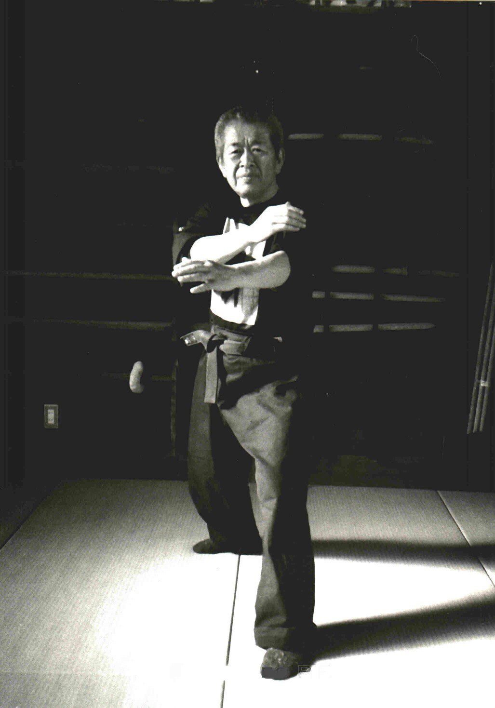

# Значение Камаэ в системе Будзинкан

Словарь Яркси утверждает, что слово камаэ (яп. [kamae]) можно перевести как структура, конструкция, устройство. В значении глагольной форме (яп. [kamaeru]) это слово может означать принимать положение, настраиваться, готовиться, строить.

Для большой армии камаэ - это оборонительные порядки, боевое построение, огневые позиции. Но камаэ не заканчивается на этом. Не менее важно тыловое обеспечение, пути передачи информации, внутренняя структура соединения, соблюдения субординации, подготовленные пути отхода и даже наличие точильного камня в походной кухне. Недостаток в каждом из этих аспектов может привести боевое соединение в состояние невозможности выполнения задачи.

Невозможно эффективно действовать с нарушенным камаэ. Когда отряды идут в наступление и наносят свой удар, все отряды должны действовать связанно, как единое целое, не нарушая общей структуры. Если один из отрядов не выйдет вовремя на нужную позицию, штурм не будет иметь успеха.

Важность камаэ переоценить нельзя.

Если во время обороны противник подавит огневые точки, удерживать позицию будет очень сложно. Если противник свяжет ваши отряды и не даст вам подвести боеприпасы, он может победить и вовсе не нападая.

Противник может измотать вас. В длительном сражении важно давать отдых войскам. Если у вас не будет времени на отдых и перегруппировку, если вы не организовали подвоз провианта, вы не сможете долго вести сражение. Нужно знать свои возможности и уметь вовремя восстанавливаться там, где нарушено ваше равновесие.

Если противник наносит удар, вы можете встретить его в лоб. Но, чтобы принять лобовой удар и не нарушить своего камаэ, нужно превосходить противника в силе, умении и иметь очень качественное камаэ. Если же вы нарушили свое камаэ, приняв первый удар, остановить второй будет во много раз сложнее. Это также работает и в обратную сторону. Не всегда удар должен бить на поражение. Если ваш удар вывел противника из равновесия, нарушил его камаэ, это определенно хороший удар.

Если вы приняли решение уйти с линии удара, вы должны иметь ввиду свое камаэ. Поспешное отступление не должно нарушить синхронности в работе всех частей тела, не должно привести к нарушению равновесия, иначе последовав за вами, противник с легкостью развеет в пыль остатки вашего камаэ. Если же, отступая вы сможете завлечь противника и заставить его нарушить эффективное камаэ в попытке достать вас, вы с лёгкостью сможете перейти в контратаку.

Камаэ незаметно. Красивые позиции с правильно развернутыми стопами, в нужном месте находящимися руками и в нужную точку смотрящими глазами - это внешний слой снега над айсбергом камаэ. Чтобы действовать эффективно, нужно понимать своё камаэ и камаэ противника, видеть и чувствовать слабые стороны своей позиции и позиции противника.

Немаловажной частью работы с камаэ является понимание механики тела. Выполнить залом можно механически, без понимания, как это делают новички, но только понимая степени свободы и диапазоны работы суставов, можно по настоящему контролировать камаэ противника.

Краеугольным камнем камаэ является центр. Законы физики таковы, что при оптимальном движении центр перемещается равномерно. Если траектория вашего центра зигзагообразна, ваш центр вихляет, или ходит вверх-вниз, можно однозначно сказать, что ваше движение не оптимально. Можно также взять в рассмотрение центр вашего противника. Противник движется туда же, куда движется его центр. Поэтому, если вы хотите проводить противник куда-либо, вы должны проводить его центр. Чтобы противник упал, вы должны вывести центр за пределы базы, образованной его ступнями, а чтобы не упасть самому, следует перемещать базу вслед за движением своего центра. Нужно научиться двигаться так, чтобы центр приводился в движение мгновенно. Тогда движение будет быстрым.

Камаэ противника рассказывает будущее. Если противник понимает свое камаэ, он будет действовать так, как это будет эффективно, исходя из занимаемого им камаэ. Если вы хорошо понимаете камаэ своего противника, вы сможете предсказать его действия за полсекунды до их совершения. Это знание позволяет своевременно уходить из-под удара.

По мере изучения камаэ, боевая стойка становится обыденной, а обыденная боевой. Те принципы движения и выстраивания своей позиции, которые изучаются на тренировках позволяют увереннее двигаться в повседневности. Однажды освоив перемещение центра, можно обнаружить перемены в своей походке, ведь организм всегда использует самые эффективные известные ему схемы движения и разучиться этому будет очень сложно. С другой же стороны по мере привыкания тела к работе с камаэ, боевая стойка становится все более и более естественной для вас, и вы работаете в ней более свободно. Этот процесс начинается с двух сторон и продолжается до тех пор, пока боевая и обыденная стойки не сольются воедино.

Говоря про камаэ, часто говорят про его психологическую составляющую. Камаэ продолжается в эмоциях, в готовности действовать и уверенности в своих силах. Положение тела должно отвечать психологическому состоянию. Если ваша позиция агрессивна, ваше сознание тоже должно быть таким. Если вы укоренились, нужно быть готовым выстоять, даже если на вас едет бульдозер. Нужно уметь менять психологическое состояние так же быстро, как и положение тела. Но, не следует думать, что этот аспект камаэ как-то выделяется из общей схемы. Напротив, это лишь малая толика в общем принципе "все части целого должны действовать сообща".
