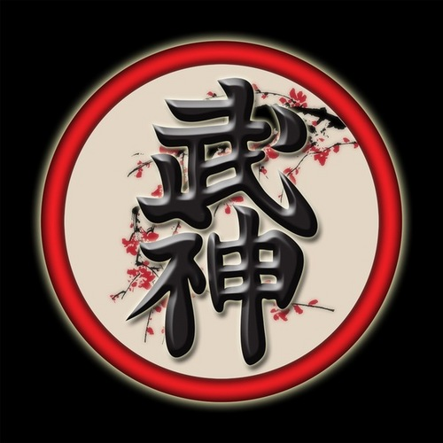

Московское отделение клуба исскуств востока "Будзинкан" проводит набор в группы по изучению боевого исскуства "Будзинкан Будо Тайдзюцу".
В программе изучения техника и принципы традиционных японских школ боевых исскуств, ударная, бросковая техника, работа с оружием.

Занятия проводят:
Карауш Дмитрий, 9-ый дан, тел. 89261221887
Вторник, Четверг - с 19:00 до 21:00. м. Нагорная, Криворожская, д.6, стр.3.
Воскресение - с 17:00 до 19:00. Москва, м. Нагатинская, Коломенская. 1-й Нагатинский пр-д, д.15 (club 18)

Сорокин Николай, 1-ый дан, тел. 89167349803
Занятия проходят:
Вторник, Четверг - с 20:00 до 22:00. Воскресение - с 11:00 до 14:00. Москва, м. Проспект Мира. Олимпийский проспект, д.16, стр.1 (в здании с.к. Олимпийкий). 

Первое занятие бесплатно.
Дополнительная информация: http://ninpojapan.ru, http://mo-cgs.ru/bujinkan/
